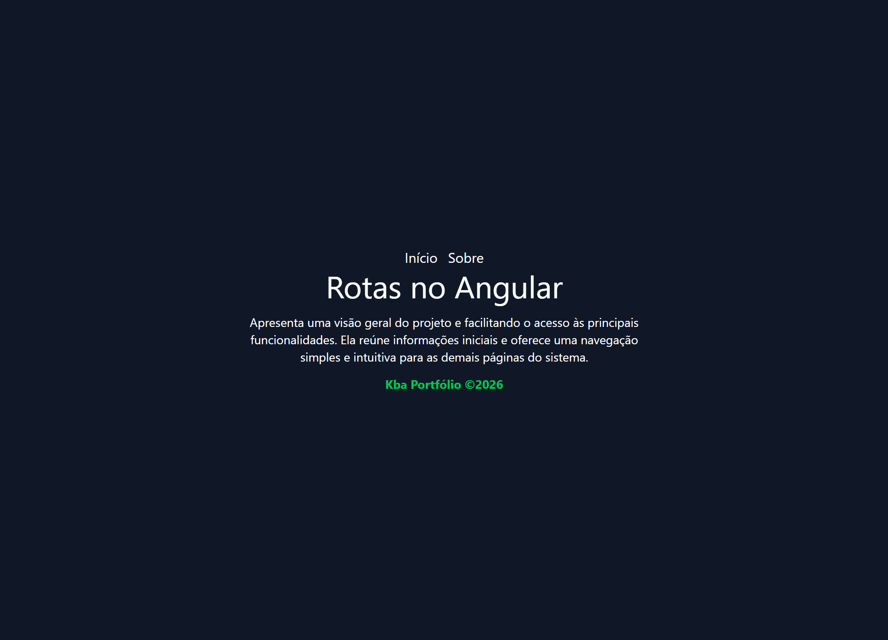

# Rotas

## Objetivo

Aprender a configurar e utilizar rotas no Angular para navegar entre páginas, organizar a aplicação e proporcionar uma experiência fluida ao usuário.

Acesse o aplicativo: [Rotas no Angular](https://albuquerque-katarine.github.io/angular-router-app-2/)

## Tecnologias

* Angular
* TypeScript
* HTML5
* Tailwind CSS
* Router
* Signals
* Data Binding
* Interpolação
* Componentes Standalone
* Componentização

## Configuração

#### Instalar dependências: ``npm install``
#### Start da aplicação: ``ng serve`` ou ``ng s``
#### Abrir no navegador: ``http://localhost:4200/``

## Contatos
- E-mail: [kba.2879@gmail.com](mailTo:kba.2879@gmail.com)
- Linkedin: [/katarine-albuquerque](https://www.linkedin.com/in/katarine-albuquerque/)
